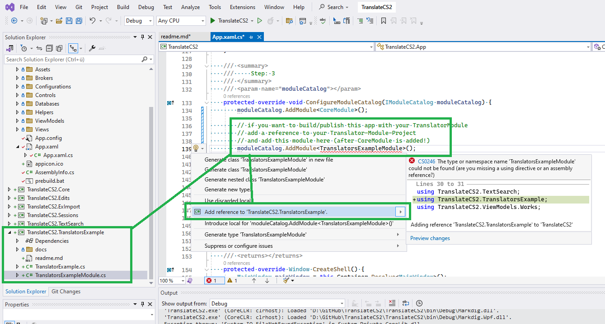
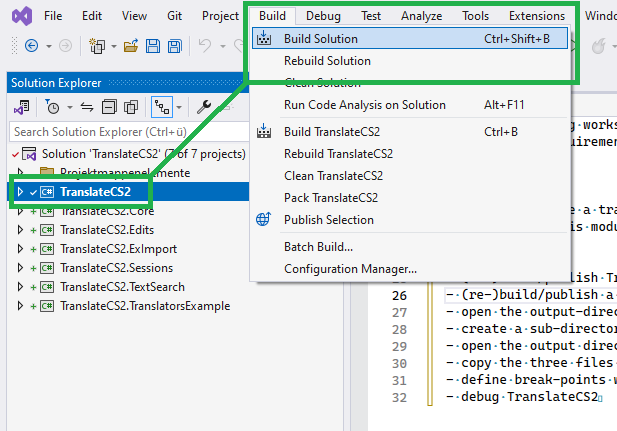
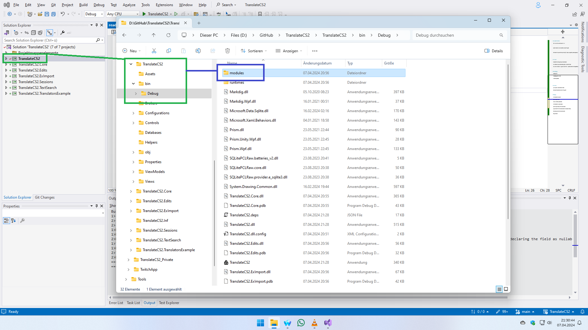
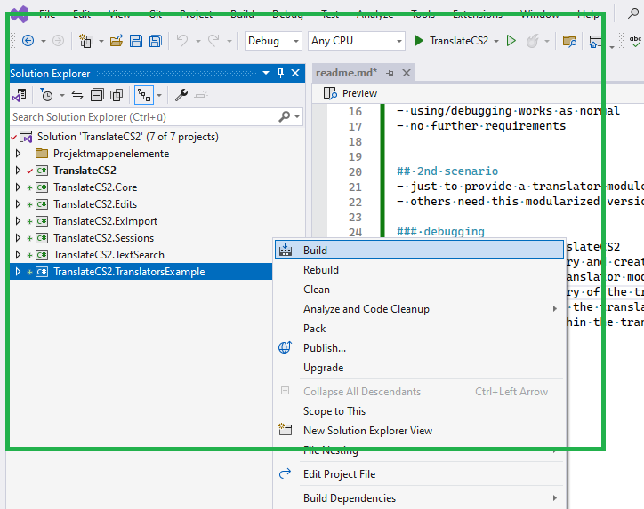
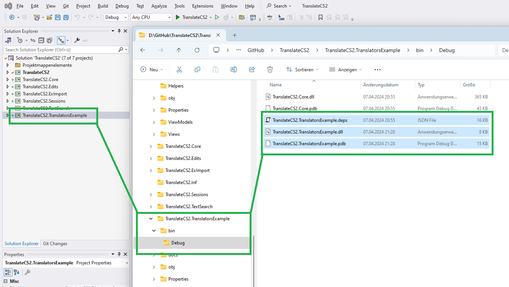
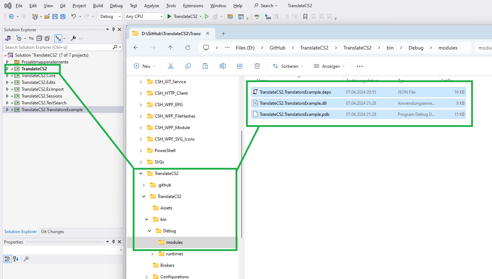
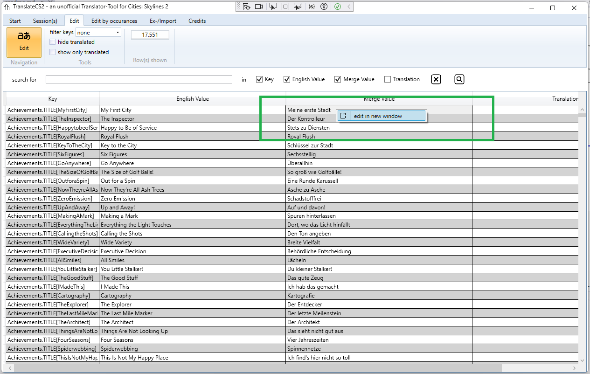
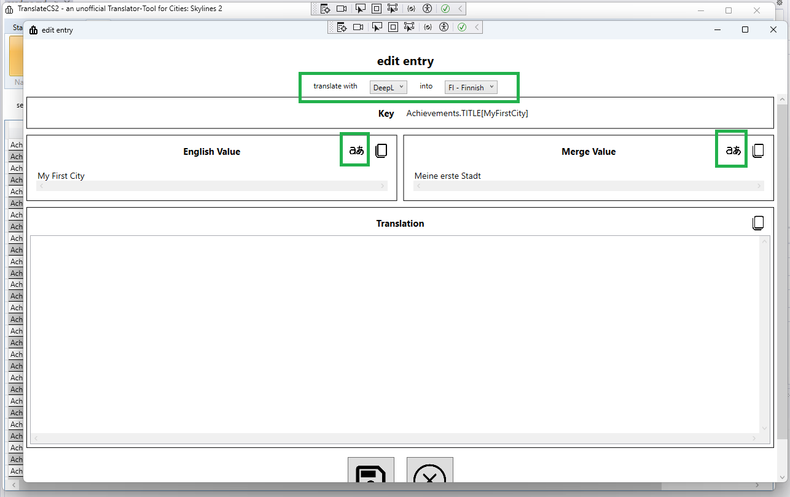
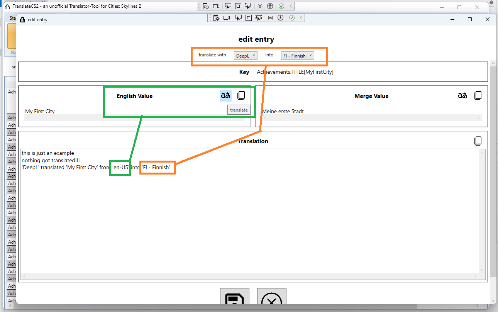
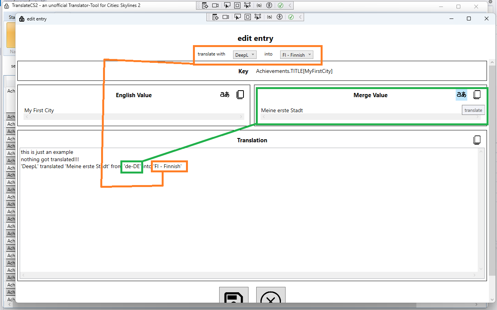

# early adopters (currently)
- TODO: I do not like to write that much :D :D :D

- project TranslateCS2 can not be published as single-file anymore

- both scenarios: be very careful with your API-Key(s), it/they can be gatherd by reverse-engineering!!!

## 1st scenario
- build/publish this tool/app with your translator-module
- add a reference to your translator-module-project to TranslateCS2-Project
- take a look at TranslateCS2 -> App.xaml.cs (the c#-file!) -> protected override void ConfigureModuleCatalog(IModuleCatalog moduleCatalog);
- 

### using/debugging
- everythings fine
- using/debugging works as normal
- no further requirements

## 2nd scenario
- just to provide a translator-module to others
- others need this modularized version of this app/tool

### debugging
- (re-)build/publish TranslateCS2
- 
- open the output-directory and create a sub-directory named modules
- 
- (re-)build/publish a translator module
- 
- open the output directory of the translator module
- 
- copy the three files of the translator module into the modules directory
- 
- define break-points within the translator module, if needed
- debug TranslateCS2
- what it should look like:
- 
- 
- 
- 